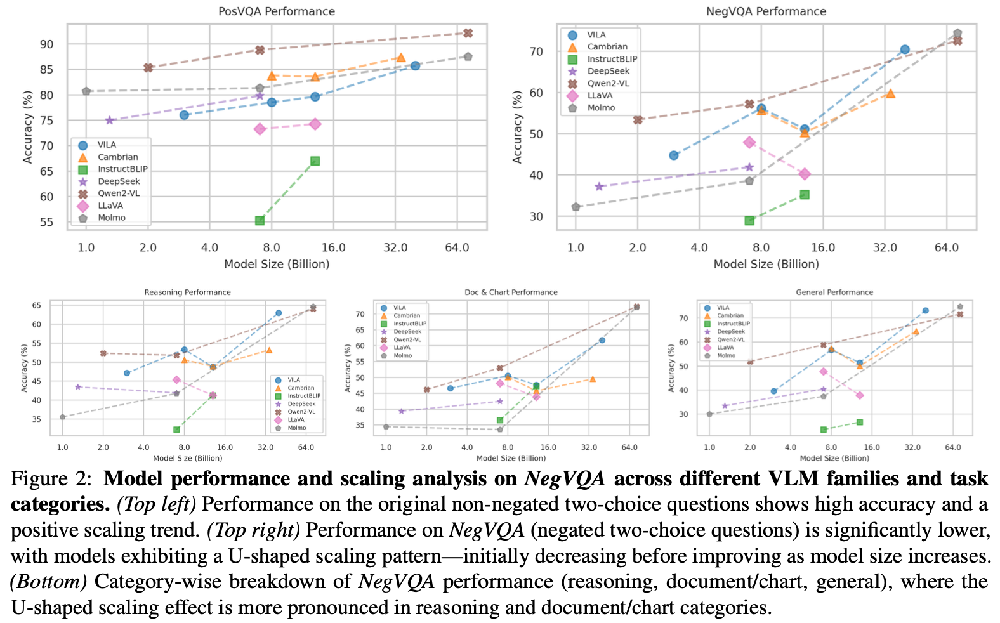

# NegVQA: Can Vision Language Models Understand Negation?

[](https://lbesson.mit-license.org/)
[](https://www.python.org/downloads/release/python-311/)
[](https://pytorch.org/get-started/previous-versions/#v25)
[](https://github.com/ambv/black)

This repo provides the PyTorch source code of our paper: [NegVQA: Can Vision Language Models Understand Negation?](https://www.arxiv.org/abs/2505.22946) (**ACL 2025 Findings**). Check out project page [here](https://yuhui-zh15.github.io/NegVQA/)!

## 🔮 Abstract

Negation is a fundamental linguistic phenomenon that can entirely reverse the meaning of a sentence. As vision language models (VLMs) continue to advance and are deployed in high-stakes applications, assessing their ability to comprehend negation becomes essential. To address this, we introduce NegVQA, a visual question answering (VQA) benchmark consisting of 7,379 two-choice questions covering diverse negation scenarios and image-question distributions. We construct NegVQA by leveraging large language models to generate negated versions of questions from existing VQA datasets. Evaluating 20 state-of-the-art VLMs across seven model families, we find that these models struggle significantly with negation, exhibiting a substantial performance drop compared to their responses to the original questions. Furthermore, we uncover a U-shaped scaling trend, where increasing model size initially degrades performance on NegVQA before leading to improvements. Our benchmark reveals critical gaps in VLMs' negation understanding and offers insights into future VLM development. Project page available at .


## 🛠️ Adding Negation to VQA Datasets

Check out [add_negation.ipynb](add_negation.ipynb) for the implementation of adding negation to VQA datasets.

## 💎 Dataset: NegVQA

</img>

Dataset is available at [Huggingface](https://huggingface.co/datasets/yuhuizhang/NegVQA).

## 📈 Evaluation of NegVQA

</img>

Model predictions are available at [Huggingface](https://huggingface.co/datasets/yuhuizhang/NegVQA/tree/main/model_preds). These predictions are generated using [VLMEvalKit](https://github.com/open-compass/VLMEvalKit). The running script is [evaluate_models.sh](evaluate_models.sh). Results are plotted from [plot_results.ipynb](plot_results.ipynb).

## 🎯 Citation

If you use this repo in your research, please cite it as follows:
```
@inproceedings{NegVQA,
  title={NegVQA: Can Vision Language Models Understand Negation?},
  author={Yuhui Zhang and Yuchang Su and Yiming Liu and Serena Yeung-Levy},
  booktitle={ACL 2025 (Findings)},
  year={2025}
}
```
